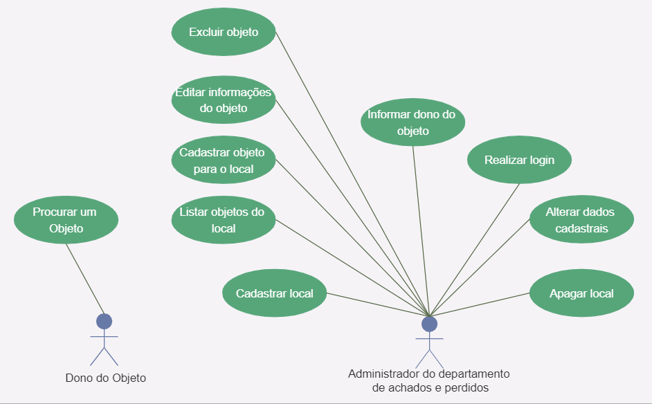
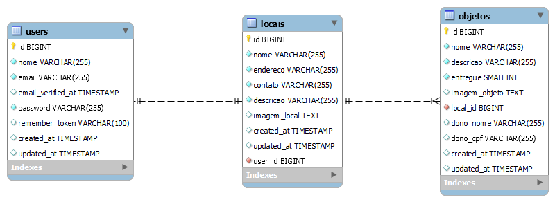

# Desafio: Achados e Perdidos

  

  Achados e Perdidos by <a href="https://github.com/treinaweb">TreinaWeb</a>

## Índice

- [Descrição](#descrição)
- [Requisitos](#requisitos)
- [Diagrama de caso de uso](#diagrama-de-casos-de-uso)
- [Diagrama do banco de dados](#diagrama-do-banco-de-dados)
- [Casos de uso](#casos-de-uso)
- [Layout da aplicação](#layout-da-aplicação)
- [Divisão das entregas](#divisão-das-entregas)

## Descrição

Permitir que pessoas encontrem seus objetos perdidos de maneira mais fácil, além de facilitar a vida de pessoas responsáveis por comércios, condomínios e outros locais públicos que possuem sala de Achados e Perdidos.

## Requisitos

- [Requisitos do usuário](./requisitos/requisitos-usuario.md)
- [Requisitos Funcionais](./requisitos/requisitos-funcionais.md)
- [Requisitos Não Funcionais](./requisitos/requisitos-nao-funcionais.md)

## Diagrama de casos de uso

A aplicação possui dois atores, o dono do objeto e o administrador do departamento de achados e perdidos. O diagrama abaixo demonstra quais ações cada um dos atores pode realizar.

## Diagrama do banco de dados

A aplicação terá três tabelas que irão se relacionar entre si, sendo elas as tabelas `users`, `locais` e `objetos`. No diagrama abaixo é possível ver os detalhes de cada uma dessas tabelas e como as mesmas se relacionam.

## Casos de uso

Abaixo pode ser encontrada uma descrição textual mais detalhada sobre cada um casos de uso exitentes na aplicação.

- [Casos de Uso](./casos-de-uso/casos-de-uso.md)

## Layout da aplicação

Abaixo estão os links para acessar os [wireframes](https://pt.wikipedia.org/wiki/Website_wireframe) e [mockups](https://pt.wikipedia.org/wiki/Mockup) da aplicação.

- [Wireframes](https://whimsical.com/mockup-achados-e-perdidos-DsnQVGKsruoBwHHFeppvuy)
- [Mockups](https://www.figma.com/file/Ff4ghTnINeyT9vHDil0goa/Achados-e-Perdidos)

## Divisão das entregas

O desenvolvimento do sistema será dividido em quatro entregas acumulativas, cada entrega terá quais funcionalidades do sistema devem ser desenvolvidas, abaixo estão os links para ver os detalhes do quê deve ser desenvolvido em cada uma das entregas.

- [Primeira entraga](./entregas/primeira-entrega.md)
- [Segunda entraga](./entregas/segunda-entrega.md)
- [Terceira entraga](./entregas/terceira-entrega.md)
- [Quarta entraga](./entregas/quarta-entrega.md)