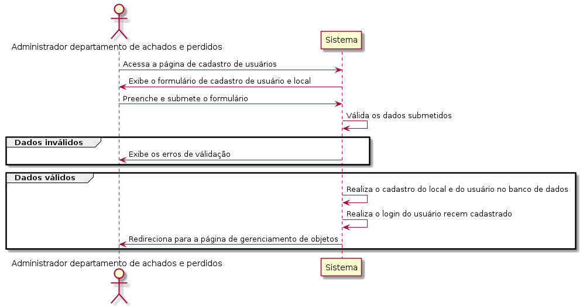

# Casos de Uso

## DOP01 - Procurar um Objeto

O dono de um objeto perdido poderá realizar a busca. O sistema deve permitir que ele busque o local por onde passou no dia que perdeu o objeto. Se o local tiver cadastro, deve ser exibida a lista com os objetos disponíveis para retirada. Por fim, se o objeto tiver disponível, o sistema deve apresentar os contatos do departamento de achados e perdidos do local.

### Precondição

Nenhuma

### Ator

Dono Objeto

### Fluxo de eventos

## RAP01 - Cadastrar local

O administrador do departamento de achados e perdidos poderá realizar o cadastro do local na plataforma. O sistema deve permitir que ele entre com os dados do local e os dados de acesso à plataforma.

### Precondição

Nenhuma

### Ator

Administrador departamento de achados e perdidos

### Fluxo de eventos

