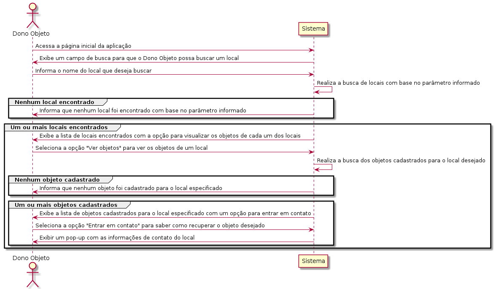
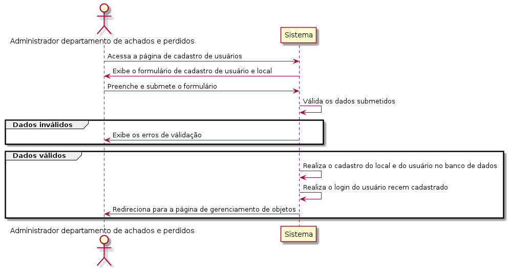
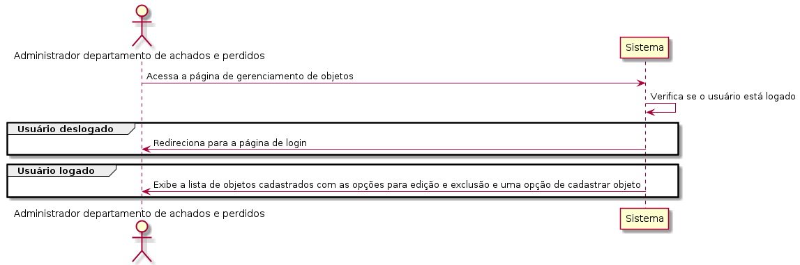
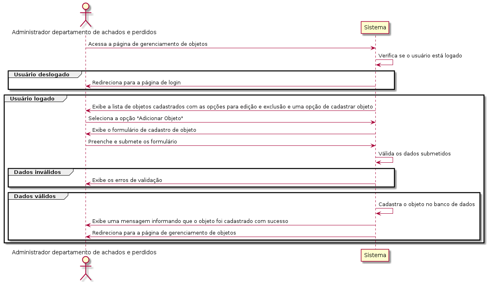
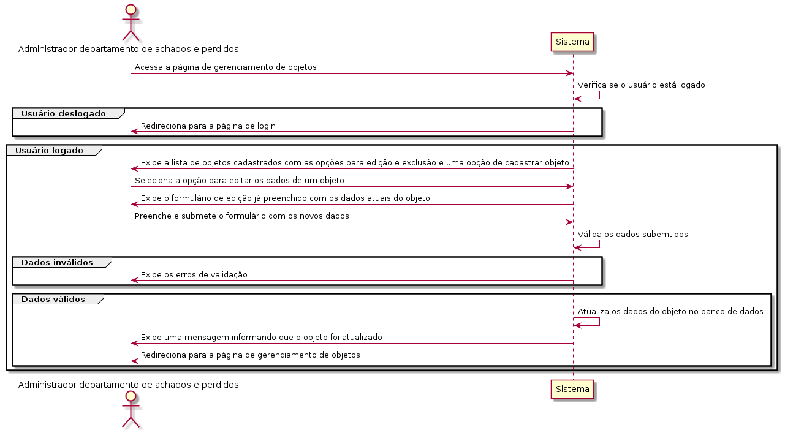
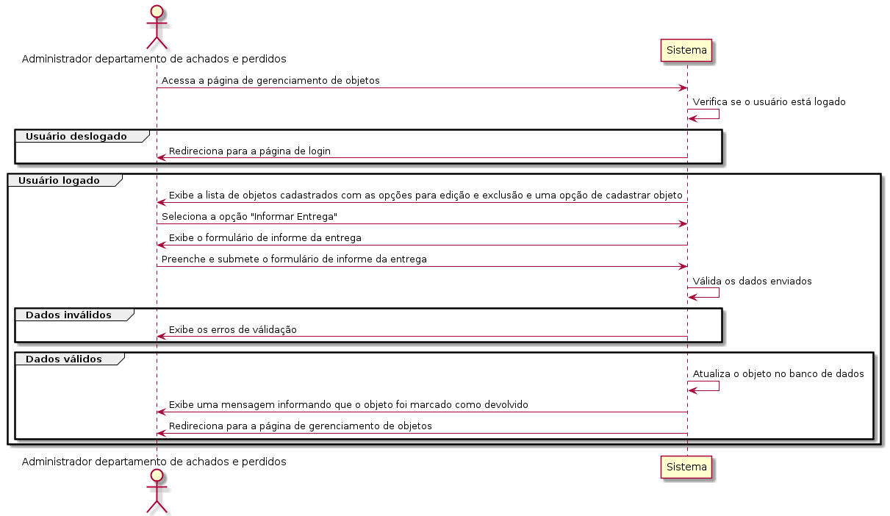
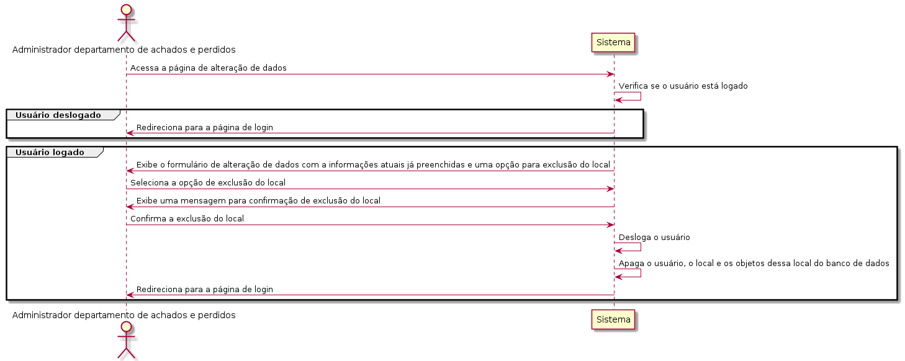
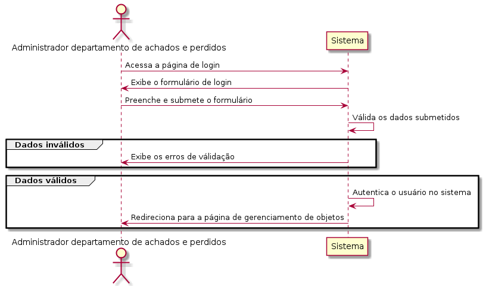

# Casos de Uso

## DOP01 - Procurar um Objeto

O dono de um objeto perdido poderá realizar a busca. O sistema deve permitir que ele busque o local por onde passou no dia que perdeu o objeto. Se o local tiver cadastro, deve ser exibida a lista com os objetos disponíveis para retirada. Por fim, se o objeto tiver disponível, o sistema deve apresentar os contatos do departamento de achados e perdidos do local.

### Precondição

Nenhuma

### Ator

Dono Objeto

### Fluxo de eventos

## RAP01 - Cadastrar local

O administrador do departamento de achados e perdidos poderá realizar o cadastro do local na plataforma. O sistema deve permitir que ele entre com os dados do local e as informações de acesso à plataforma.

### Precondição

Nenhuma

### Ator

Administrador departamento de achados e perdidos

### Fluxo de eventos

## RAP02 - Listar objetos do local

O administrador do departamento de achados e perdidos poderá realizar a listagem dos objetos cadastrados para o local.

### Precondição

O usuário deve estar logado no sistema como um dos atores do caso de uso.

### Ator

Administrador departamento de achados e perdidos

### Fluxo de eventos

## RAP03 - Cadastrar objeto para o local

O administrador do departamento de achados e perdidos poderá realizar o cadastro de um objeto para o local.

### Precondição

O usuário deve estar logado no sistema como um dos atores do caso de uso.

### Ator

Administrador departamento de achados e perdidos

### Fluxo de eventos

## RAP04 - Editar informações do objeto

O administrador do departamento de achados e perdidos poderá realizar a edição das informações de um objeto previamente cadastrado para o local.

### Precondição

O usuário deve estar logado no sistema como um dos atores do caso de uso.

### Ator

Administrador departamento de achados e perdidos

### Fluxo de eventos

## RAP05 - Informar dono do objeto

O administrador do departamento de achados e perdidos deverá informar a entrega de um objeto ao dono. O sistema deverá solicitar o nome e CPF do dono. Após definido como entregue, o objeto não poderá mais ser exibido na plataforma.

### Precondição

O usuário deve estar logado no sistema como um dos atores do caso de uso.

### Ator

Administrador departamento de achados e perdidos

### Fluxo de eventos

## RAP06 - Realizar login

O administrador do departamento de achados e perdidos poderá realizar login na plataforma. Após o login ele deve ser direcionado para a lista de objetos.

### Precondição

O usuário deve estar cadastrado no sistema como um dos atores do caso de uso.

### Ator

Administrador departamento de achados e perdidos

### Fluxo de eventos

## RAP07 - Alterar dados cadastrais

O sistema deverá permitir ao administrador do departamento de achados e perdidos alterar suas informações de acesso, além dos dados do local que ele é responsável.

### Precondição

O usuário deve estar logado no sistema como um dos atores do caso de uso.

### Ator

Administrador departamento de achados e perdidos

### Fluxo de eventos

## RAP08 - Apagar local

O administrador do departamento de achados e perdidos poderá excluir o local da plataforma. O sistema deve excluir também os dados e acesso e os objetos do local.

### Precondição

O usuário deve estar logado no sistema como um dos atores do caso de uso.

### Ator

Administrador departamento de achados e perdidos

### Fluxo de eventos

