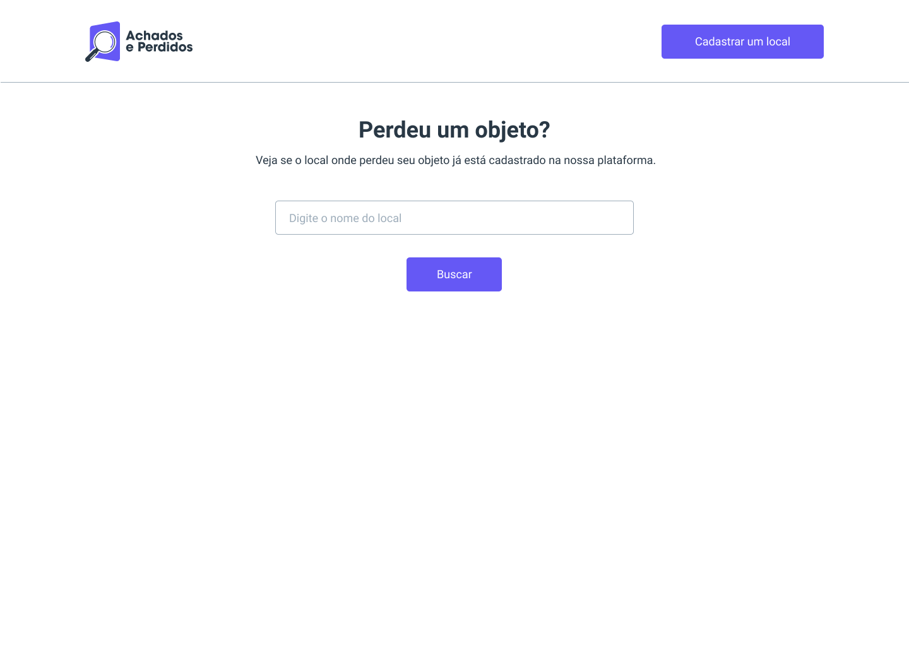
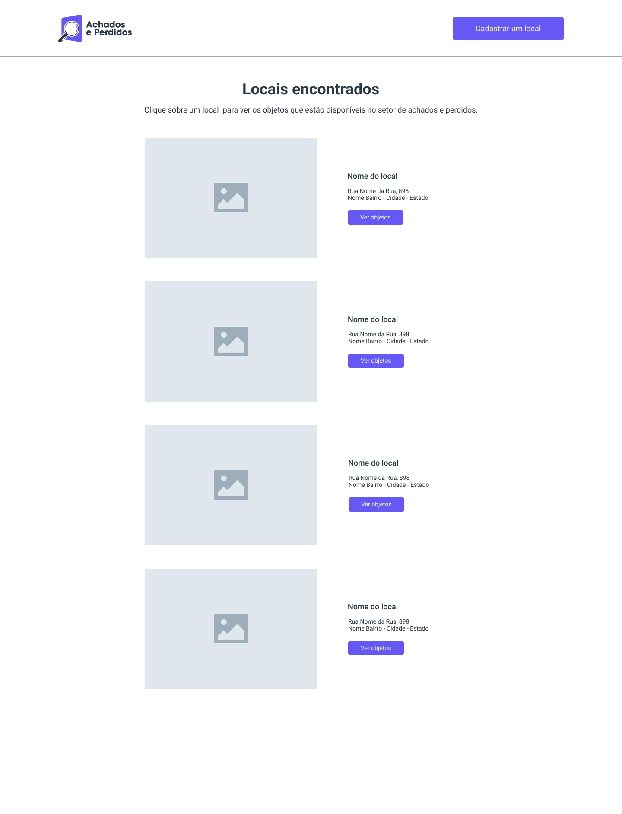
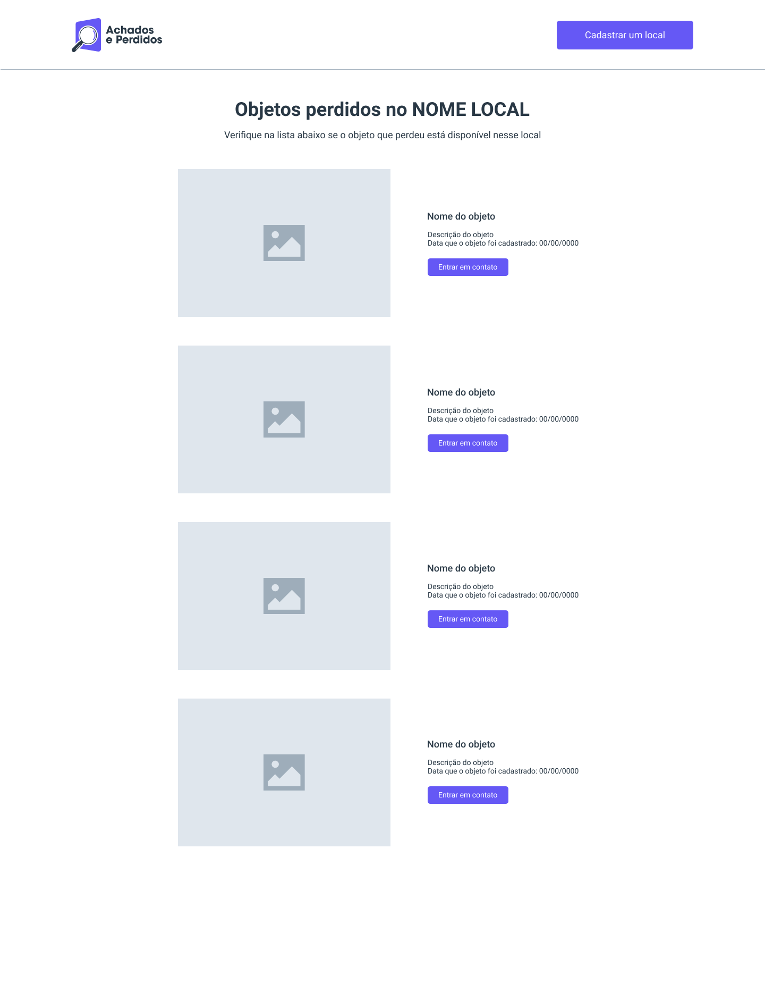

# Terceira Entrega

## Descrição

Durante essa entrega você terá que desenvolver as rotas e telas referentes as funcionalidades da página inicial e busca de locais.

## Requisitos Funcionais

Os requisitos funcionais que estão relacionados com essa entrega são:

- **DOP01 - Procurar um Objeto:** O dono de um objeto perdido poderá realizar a busca. O sistema deve permitir que ele busque o local por onde passou no dia que perdeu o objeto. Se o local tiver cadastro, deve ser exibida a lista com os objetos disponíveis para retirada. Por fim, se o objeto tiver disponível, o sistema deve apresentar os contatos do departamento de achados e perdidos do local.

## DOP01 - Procurar um Objeto

Abaixo você encontrará todas as informações do quê e como deve ser desenvolvido no back-end e no front-end para o caso de uso DOP01.

## Back-end

### Rotas

| Rota                          | Verbo HTTP | Descrição                                                      |
|-------------------------------|------------|----------------------------------------------------------------|
| /api/locais/busca             | GET        | Rota responsável por buscar locais cadastrados por nome        |
| /api/locais/{localId}/objetos | GET        | Rota responsável por listar os objetos cadastrados de um local |

### Rota GET /api/locais/busca

**Dados da requisição**

Na rota deve ser enviado uma query string chamada `nome` do tipo string contendo o valor da busca.

**Dados da resposta**

Dados do local

| Campo     | Tipo    | Exemplo                                                                    |
|-----------|---------|----------------------------------------------------------------------------|
| id        | int     | 1                                                                          |
| nome      | string  | Padaria do Sabor                                                           |
| endereco  | string  | av jardim japao, 98 - Centro - SBC                                         |
| contato   | string  | Whats: 11 99712-3550                                                       |
| descricao | string  | Padaria do bairro                                                          |
| imagem    | string  | http://localhost:8080/imagens/yXNmbLqtqgIaMyVyhQGDCZuIJMwSQ5UQMV6ystLs.png |                  |

Hateoas do local

| Type          | Rel           | Uri                            |
|---------------|---------------|--------------------------------|
| GET           | objetos_local | /api/locais/{objetoId}/objetos |

**Exemplo de requisição**

```
GET /api/locais/busca?nome=padaria HTTP/1.1
Host: localhost:8080
Accept: */*
```

**Exemplos de respostas**

```
HTTP/1.1 200 OK
Content-Type: application/json

[
  {
    "id": 1,
    "nome": "Padaria do Sabor",
    "endereco": "av jardim japao, 98 - Centro - SBC",
    "contato": "Whats: 11 99712-3550",
    "descricao": "padaria do bairro",
    "imagem": null,
    "links": [
      {
        "type": "GET",
        "rel": "objetos_local",
        "uri": "/api/locais/1/objetos"
      }
    ]
  }
]
```

### Rota GET /api/locais/{localId}/objetos

**Dados da requisição**

Não se aplica

**Dados da resposta**

Dados do objeto

| Campo         | Tipo     | Exemplo                                                                    |
|---------------|----------|----------------------------------------------------------------------------|
| id            | int      | 1                                                                          |
| nome          | string   | Guarda Chuva                                                               |
| descricao     | string   | Cor preta                                                                  |
| entregue      | boolean  | false                                                                      |
| data_cadastro | string   | 2022-01-01                                                                 |
| imagem        | string   | http://localhost:8080/imagens/yXNmbLqtqgIaMyVyhQGDCZuIJMwSQ5UQMV6ystLs.png |

**Exemplo de requisição**

```
GET /api/locais/1/objetos HTTP/1.1
Host: localhost:8080
Accept: */*
```

**Exemplos de respostas**

```
HTTP/1.1 200 OK
Content-Type: application/json

[
  {
    "id": 1,
    "nome": "Guarda Chuva",
    "descricao": "Cor preta",
    "entregue": false,
    "data_cadastro": "2022-01-01",
    "imagem": "http://localhost:8080/imagens/yXNmbLqtqgIaMyVyhQGDCZuIJMwSQ5UQMV6ystLs.png",
  }
]
```

## Front-end

## Telas

Para esse caso de uso as tela à serem desenvolvidas é a tela da página incial, a tela de busca de locais e a tela de listagem de objetos por local.

### Tela da página inicial

Essa tela deve conter um campo para buscar um local por nome.



### Tela de busca de locais

Essa tela deve exibir a lista dos locais encontrados com base no criterio de busca informado pelo usuário.



### Tela de listagem de objetos por local

Essa tela deve exibir a lista de objetos cadastrados para um local especifico.

